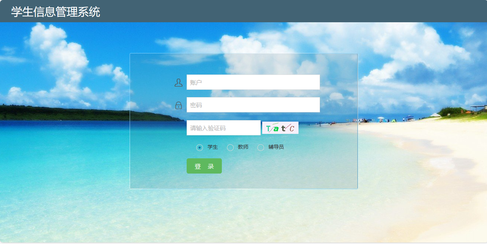
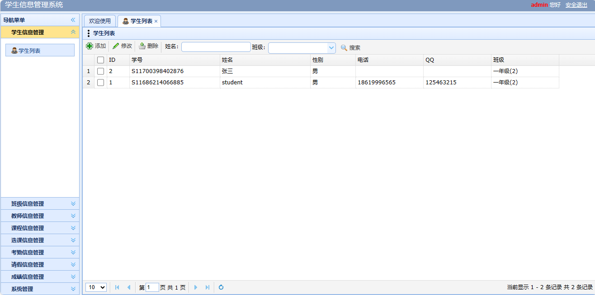
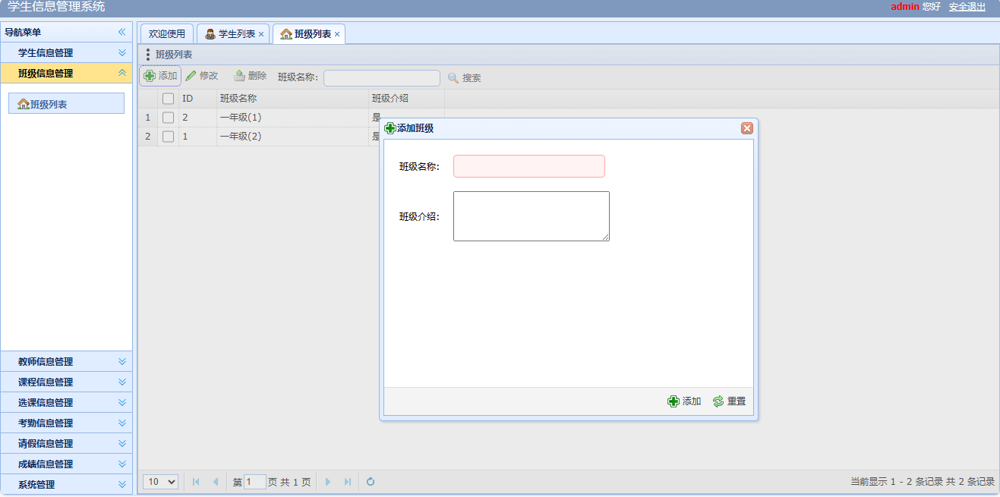
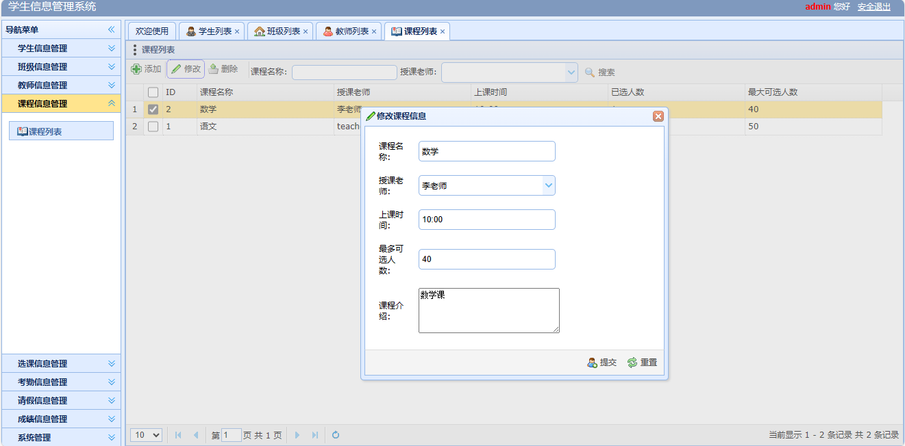
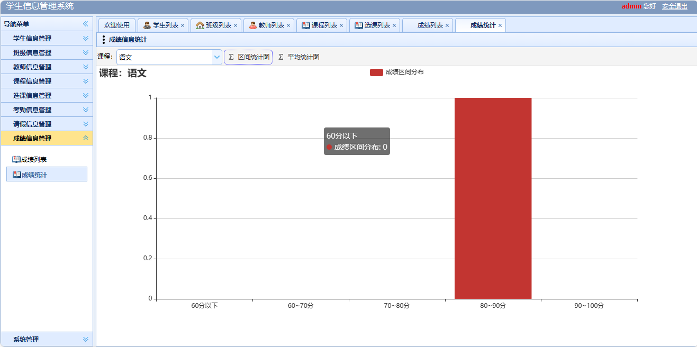

<h1 align="center">16.学生信息管理系统</h1>

 获取sql文件 QQ: 386869957 QQ群: 377586148 

 [个人站点: 从戎源码网](https://armycodes.com/)

## 简介

> 本代码来源于网络,仅供学习参考使用!
>
> 提供1.远程部署/2.修改代码/3.设计文档指导/4.框架代码讲解等服务
>
> 登录地址：http://localhost:8080/index.jsp
>
> 学生：student   密码: 123456
> 
> 老师：teacher   密码: 123456
>
> 辅导员: admin   密码: 123456
>

## 项目介绍

学生信息管理系统：前端jsp、easyui、jquery，后端 servlet，系统角色分为：学生、老师、辅导员，一个可以让学生在电脑上选课、请假和查询成绩的系统；主要功能如下：

### 学生：

- 基本功能：登录、安全退出、修改密码
- 学生信息管理：学生列表、根据姓名和班级搜索学生、学生信息修改
- 选课信息管理：根据学生和课程搜索选课信息、选课列表、添加选课、选课退选
- 考勤信息管理：条件搜索、考勤列表、添加考勤
- 请假信息管理：条件搜索、请假列表、添加请假信息、修改请假信息、删除请假信息
- 成绩信息管理：根据学生和课程名称搜索记录

### 老师：

- 基本功能：登录、安全退出、修改密码
- 学生信息管理：学生列表、根据姓名和班级搜索学生、学生信息修改
- 选课信息管理：根据学生和课程搜索选课信息、选课列表
- 考勤信息管理：条件搜索、考勤列表、添加考勤、删除考勤
- 成绩信息管理：根据学生和课程名称搜索记录、成绩列表、添加成绩信息、导入成绩、导出成绩、修改成绩、删除成绩、成绩区间统计、成绩平均统计

### 辅导员：

- 基本功能：登录、安全退出、修改密码
- 学生信息管理：学生列表、根据姓名和班级搜索学生、学生信息添加、学生信息修改、学生信息删除
- 班级信息管理：班级信息列表、根据姓名和班级搜索、添加班级信息、修改班级信息、删除班级信息
- 教师信息管理：教师列表、根据姓名和班级搜索、添加教师信息、修改教师信息、删除教师信息
- 课程信息管理：课程列表、根据课程名称和授课老师搜索、添加课程信息、修改课程信息、删除课程信息
- 选课信息管理：根据学生和课程搜索选课信息、选课列表、添加选课、选课退选
- 考勤信息管理：条件搜索、考勤列表、添加考勤、删除考勤
- 请假信息管理：条件搜索、请假列表、添加请假信息、修改请假信息、删除请假信息、审核请假信息
- 成绩信息管理：根据学生和课程名称搜索记录、成绩列表、添加成绩信息、导入成绩、导出成绩、修改成绩、删除成绩、成绩区间统计、成绩平均统计

## 环境

- <b>IntelliJ IDEA 2009.3</b>

- <b>Mysql 5.7.26</b>

- <b>Tomcat 7.0.73</b>

- <b>JDK 1.8</b>

## 运行截图

