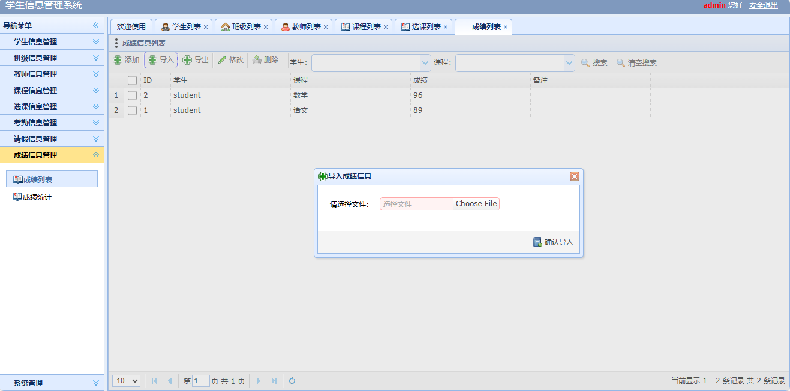

<h1 align="center">16.学生信息管理系统</h1>

- <b>完整代码获取地址：从戎源码网 ([https://armycodes.com/](https://armycodes.com/))</b>
- <b>技术探讨、资料分享，请加QQ群：692619798</b> 
- <b>作者微信：19941326836  QQ：952045282</b> 
- <b>承接计算机毕业设计、Java毕业设计、Python毕业设计、深度学习、机器学习</b>
- <b>选题+开题报告+任务书+程序定制+安装调试+论文+答辩ppt 一条龙服务</b>
- <b>所有选题地址 ([https://github.com/YuLin-Coder/AllProjectCatalog](https://github.com/YuLin-Coder/AllProjectCatalog)) </b>

## 项目介绍

学生信息管理系统：前端jsp、easyui、jquery，后端 servlet，系统角色分为：学生、老师、辅导员，一个可以让学生在电脑上选课、请假和查询成绩的系统；主要功能如下：

### 学生：

- 基本功能：登录、安全退出、修改密码
- 学生信息管理：学生列表、根据姓名和班级搜索学生、学生信息修改
- 选课信息管理：根据学生和课程搜索选课信息、选课列表、添加选课、选课退选
- 考勤信息管理：条件搜索、考勤列表、添加考勤
- 请假信息管理：条件搜索、请假列表、添加请假信息、修改请假信息、删除请假信息
- 成绩信息管理：根据学生和课程名称搜索记录

### 老师：

- 基本功能：登录、安全退出、修改密码
- 学生信息管理：学生列表、根据姓名和班级搜索学生、学生信息修改
- 选课信息管理：根据学生和课程搜索选课信息、选课列表
- 考勤信息管理：条件搜索、考勤列表、添加考勤、删除考勤
- 成绩信息管理：根据学生和课程名称搜索记录、成绩列表、添加成绩信息、导入成绩、导出成绩、修改成绩、删除成绩、成绩区间统计、成绩平均统计

### 辅导员：

- 基本功能：登录、安全退出、修改密码
- 学生信息管理：学生列表、根据姓名和班级搜索学生、学生信息添加、学生信息修改、学生信息删除
- 班级信息管理：班级信息列表、根据姓名和班级搜索、添加班级信息、修改班级信息、删除班级信息
- 教师信息管理：教师列表、根据姓名和班级搜索、添加教师信息、修改教师信息、删除教师信息
- 课程信息管理：课程列表、根据课程名称和授课老师搜索、添加课程信息、修改课程信息、删除课程信息
- 选课信息管理：根据学生和课程搜索选课信息、选课列表、添加选课、选课退选
- 考勤信息管理：条件搜索、考勤列表、添加考勤、删除考勤
- 请假信息管理：条件搜索、请假列表、添加请假信息、修改请假信息、删除请假信息、审核请假信息
- 成绩信息管理：根据学生和课程名称搜索记录、成绩列表、添加成绩信息、导入成绩、导出成绩、修改成绩、删除成绩、成绩区间统计、成绩平均统计

## 环境

- <b>IntelliJ IDEA 2009.3</b>

- <b>Mysql 5.7.26</b>

- <b>Tomcat 7.0.73</b>

- <b>JDK 1.8</b>

## 运行截图

